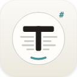

<p align="center">
  
</p>

<h1 align="center">TextPad-NXG</h1>

<p align="center">
  A small, focused text editor for macOS that reads Markdown beautifully.
</p>

<p align="center">
  <a href="https://github.com/yogiee/TextPad-NXG/releases/latest"></a>
  
  
</p>

---

It deliberately avoids becoming an IDE — no plugin marketplace, no language servers, no AI assistants. The chrome stays out of the way, and editing stays a deliberate action.

---

## Screenshots

> _Coming soon_

---

## What it does

- **Markdown is first-class.** `.md` files open in **rendered read mode** by default. One click toggles to **split: source + live preview**.
- **Plain text editor** with line numbers, focus mode, smart paste, and a monospace type stack.
- **Code viewer** for `.js`, `.ts`, `.tsx`, `.jsx`, `.php`, `.css`, `.html`, `.json`, `.py`, `.sh` with syntax highlighting — read-friendly, not an IDE.
- **RTF** files open in a paged document view with a togglable formatting toolbar.

---

## Installation

Download the latest **TextPad-NXG-x.y.z.dmg** from the [Releases](https://github.com/yogiee/TextPad-NXG/releases/latest) page, mount it, and drag **TextPad-NXG** to your Applications folder.

> **Note:** TextPad-NXG is ad-hoc signed and not notarized. On first launch, right-click the app icon → **Open**, then confirm the dialog. macOS only asks once.

---

## Building from Source

```bash
git clone https://github.com/yogiee/TextPad-NXG.git
cd TextPad-NXG
./scripts/build-app.sh         # → build/TextPad-NXG.app
./scripts/make-dmg.sh          # → build/TextPad-NXG-x.y.z.dmg (optional)
```

Or open `TextPad-NXG.xcodeproj` in Xcode and run.

---

## Features

### Editor

- NSTextView-backed plain-text and code editors with **wrap-aware line number gutter**
- **Active-line highlight** that respects wrapped fragments
- **Focus mode**: dims everything except the active logical line
- User-selectable **monospace font** (filtered to fixed-pitch families), **font size**, and **line-height multiplier**
- Theme: **light / dark / system**, plus four accent colors — teal · amber · violet · rose

### Markdown

- WKWebView-rendered preview with native **cross-block text selection**
- **Bidirectional source ↔ preview scroll sync** with feedback suppression
- Live preview that **preserves your reading position** across edits
- Supported syntax: headings, paragraphs, blockquotes, fenced code, lists, task lists, tables, strikethrough, highlight, superscript, autolinks, SmartyPants
- **Code blocks share the editor's syntax highlighter** — no JS dependency, no asset bundles
- Markdown source toolbar: H, B, I, S, link, inline code, code block, bullet/numbered/task list, blockquote, HR

### Chrome

- **Custom title bar** with traffic lights, sidebar toggle, file title, Read/Edit mode toggle, find bar, theme picker, and settings
- **Tab bar** with file-kind chips (`M↓` `JS` `TXT` `RTF`) and close buttons
- **Sidebar** (`⌘1`): Files (Starred + Recent) and Outline (markdown headings)
- **Status bar**: file kind, word/char/line/read-time counts, focus toggle, encoding
- **Find bar** (`⌘F` / `⌘⌥F`) — floats over the document with match count and replace
- **Quick Switcher** (`⌘K`): fuzzy file picker across open files

---

## Keyboard Shortcuts

| Action | Shortcut |
|---|---|
| Toggle sidebar | `⌘1` |
| Quick switcher | `⌘K` |
| Find | `⌘F` |
| Find & Replace | `⌘⌥F` |
| Toggle Read / Edit (Markdown) | `⌘E` |
| New file | `⌘N` |
| Open… | `⌘O` |
| Preferences | `⌘,` |

---

## Settings

Native macOS preferences window (`⌘,`) with four tabs:

- **Appearance** — theme · font family · font size · line-height multiplier · line length · accent color
- **Editor** — show line numbers · focus mode · smart paste
- **Markdown** — default open mode · split orientation · sync scroll
- **About** — version info, update check, GitHub link

---

## Architecture

- **SwiftUI** for the app shell, settings, sidebar, title bar, tabs, status bar
- **AppKit** (`NSViewRepresentable`) for the text editor (NSTextView / NSScrollView) and markdown preview (WKWebView)
- **Pure-Swift markdown parser** — block + inline tokenizer, HTML emitter with themed CSS injection
- **Sparkle** for over-the-air updates
- No other external dependencies

```
TextPad-NXG/
  App/         — TextPadApp, AppState, AppDelegate, AppCommands, Info.plist
  Core/        — DesignTokens, MarkdownEngine, MarkdownHTML, MdEdit, SyntaxHighlighter
  Views/       — ContentView, TitleBarView, SidebarView, StatusBarView,
                 PlainTextEditorView, CodeView, MarkdownReadView,
                 MarkdownSplitView, MarkdownWebView, RTFView, FindBarView,
                 QuickSwitcherView, SettingsView, EmptyStateView
  Utilities/   — WindowConfigurator
  Resources/   — Assets.xcassets, Fonts/
scripts/
  build-app.sh — release build → build/TextPad-NXG.app
  make-dmg.sh  — DMG packaging with drag-to-Applications layout
```

---

## Roadmap

- Code signing + notarization (so first launch doesn't need right-click → Open)
- Export to HTML and PDF
- Theme system for the markdown preview

TextPad-NXG is intentionally feature-complete as a focused editor. No plugin system, no language-server integration, no AI-assistant features are planned.

---

## Credits

- **JetBrains Mono** — the type stack, bundled under the [SIL Open Font License 1.1](https://github.com/JetBrains/JetBrainsMono/blob/master/OFL.txt)
- **MacDown** — referenced for its preferences taxonomy and editor → WKWebView pipeline pattern. TextPad-NXG is a Swift/SwiftUI rewrite, not a fork.
- **Sparkle** — over-the-air update framework

---

## License

[MIT](LICENSE) © 2026 yogiee.
